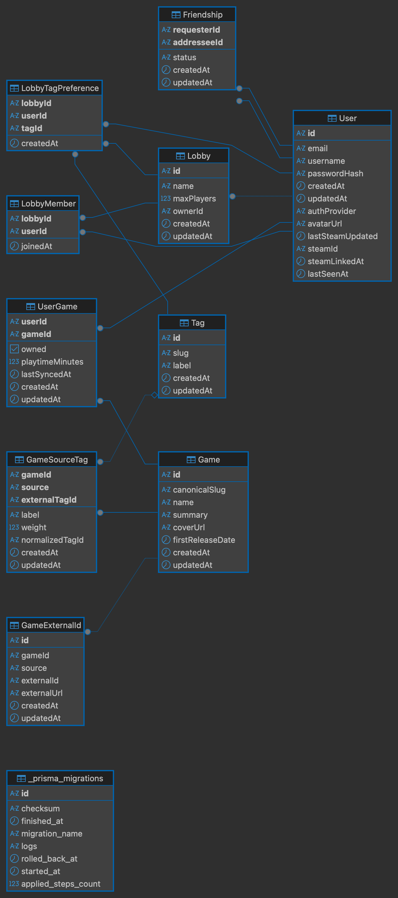

*This project has been created as part of the 42 curriculum by gaesteve, kpourcel, lepellegr, picarlie.*


## Description

### GameFinder

Our project is a multiplayer game recommendation platform. Players join lobbies, share their libraries, and a hybrid ML engine suggests games the whole group will enjoy, excluding games any member already owns.

You could discover the website here : [Gamefinder.quest](https://gamefinder.quest)

---

## Instructions

### Prerequisites
- Docker engine
- `.env` file at the root (copy `.env.example` and fill in your keys)

### Running

```bash
make up          # Build and start all services
make down        # Stop
make logs        # Live logs
make reset-db    # Wipe DB and rebuild
make fclean      # Full clean (images + volumes)
make backup      # PostgreSQL backup (pg_dump + gzip)
```

 - Access: `https://localhost` (app)
 - `https://localhost/status/` (status page) 
 - `http://localhost:3000` (Grafana)
 - `http://localhost:9090` (Prometheus)
 - `http://localhost:5050` (PgAdmin)

- Replace `localhost` with `gamefinder.quest` to access the hosted website. (Link below)
Grafana and pgadmin need an SSH tunnel. Prometheus and status page could be accessed with Nginx basic auth through `gamefinder.quest/prom/` and `gamefinder.quest/status` 

---

## Team information

| Login | Name | Role | Responsibilities |
|-------|------|------|-----------------|
| gaesteve | Gauthier Esteve | Product owner | Choose the artistic direction |
| kpourcel | Kévin Pourcel | Project manager | Handles the team organization, meetings |
| lpellegr | Léo | Technical lead | Technical choices orientation |
| picarlie| Pierre | Fullstack developer | Helped each team member to complete needed features |

---

## Project Management

Work was split by domain (backend, frontend, machine learning,  devops). Integration was coordinated via GitHub PRs and manual testing on the website. Tools: GitHub (feature branches, PRs), Notion (task tracking), Discord (main communication channel).

## Technical Stack

- ### **Frontend**

| Technology | Why |
|------------|-----|
| **React** | Industry-standard framework with component-based architecture, making it easy to split the UI into reusable, independent pieces. |
| **TypeScript** | Catches type errors at compile time instead of runtime, which helped during development since none of us had prior frontend experience. |
| **Tailwind CSS** | Utility-first approach keeps styles close to the markup, avoids CSS file bloat, and speeds up prototyping. Wide community and good docs. |
| **Vite** | Near-instant hot reload compared to Webpack. Built-in TypeScript and React support with minimal configuration. |

- ### **Backend**

| Technology | Why |
|------------|-----|
| **NestJS** | Modular architecture with built-in dependency injection, guards, and WebSocket gateway, API and real-time in the same process. |
| **Prisma** | Declarative schema as single source of truth, versioned migrations, type-safe generated client, zero raw SQL. |
| **Passport + JWT** | Stateless authentication, compatible with WebSocket handshake. Global guard protects all routes by default. |
| **Socket.io** | Handles lobby real-time events (join/leave, chat, readiness, recommendations). Built-in reconnection and room management. |

- ### **Database**

| Technology | Why |
|------------|-----|
| **PostgreSQL** | Because it can handle many simultaneous requests and learn the most used relational databases in professional environment. |
| **SQLAlchemy** | Allows to manipulate classes in python in order to communicate with the database. |

- ### **ML Service**

| Technology | Why |
|------------|-----|
| **FastAPI** | Lightweight Python API, async-ready, auto-generated docs. Isolated from the Node backend so the Python runtime is independent. |
| **scikit-learn (TF-IDF)** | Vectorizes game tags for content-based filtering. Tag weights are encoded naturally without modifying the algorithm. |
| **implicit (ALS)** | Designed for implicit feedback (playtime, not ratings). Captures latent preferences from the full user-item matrix. |

- ### **DevOps**

| Technology | Why |
|------------|-----|
| **Docker Compose** | All services (backend, frontend, DB, ML, nginx, monitoring stack) in a single reproducible setup. |
| **Nginx** | Single HTTPS entry point. Routes `/api/*` to NestJS, `/socket.io/*` to WebSocket gateway, static files to frontend. |
| **Prometheus + Grafana** | Metrics collection (pg-exporter, nginx-exporter, blackbox-exporter) with dashboards and Discord alert rules. |
| **Loki + Promtail** | Promtail scrapes Docker socket, Loki aggregates logs, Grafana visualizes them. Replaces per-container `docker logs`. |

## Database schema



---

## Features

| Feature | Description | Author |
|---------|-------------|--------|
| Local auth | Register/login with email + password, JWT | kpourcel |
| Steam OAuth | Login or link via Steam OpenID | kpourcel |
| Steam library import | Sync games + playtime from Steam API | kpourcel |
| IGDB search | Add games manually from IGDB catalog | kpourcel |
| Lobbies | Create/join sessions, real-time player list | kpourcel |
| Real-time chat | In-lobby WebSocket chat with 100-message history | gaesteve |
| Tag preferences | Select up to 3 genre tags per session to tune recommendations | kpourcel / gaesteve |
| ML recommendations | Hybrid TF-IDF + ALS, group scoring, tag boost | picarlie |
| Friend system | Add friends, online status | gaesteve / lpellegr |
| Profile | Avatar upload, username/password edit, profile pages | gaesteve |
| Monitoring | Grafana dashboards, Discord alerts, Prometheus metrics | lpellegr |
| Log management | Loki + Promtail, centralized Docker logs in Grafana | lpellegr |
| Status page | Static service health page at `/status/` | lpellegr |
| Backup | Automated PostgreSQL backup with `make backup` and disaster recovery procedures | lpellegr |

---

## Modules

| Module | Type | Pts | Author(s) | Justification |
|--------|------|-----|-----------|---------------|
| Frontend (React) + Backend (NestJS) | Major | 2 | gaesteve / kpourcel | React for component-based SPA; NestJS for modular API with built-in DI, guards, and WebSocket gateway |
| Real-time WebSockets | Major | 2 | kpourcel / gaesteve | Socket.io for lobby chat, join/leave, readiness, and recommendation broadcast |
| User interaction (chat, profiles, friends) | Major | 2 | kpourcel / gaesteve | In-lobby chat, editable profiles, friend requests with online status |
| ORM, Prisma | Minor | 1 | kpourcel | Declarative schema, versioned migrations, type-safe client — zero raw SQL |
| Additional browsers | Minor | 1 | gaesteve | Tested on Chrome, Firefox, Safari; standard CSS + Tailwind ensure compatibility |
| Standard user management | Major | 2 | kpourcel / gaesteve | Register, login, JWT, avatar, password change, profile pages |
| ML Recommendation | Major | 2 | picarlie | TF-IDF content-based + ALS collaborative filtering; adaptive ALPHA for cold-start; group scoring |
| Prometheus + Grafana | Major | 2 | lpellegr | 4 scrape targets, 5 dashboards, 3 alert rules → Discord webhook |
| Health check + status page | Minor | 1 | lpellegr | Docker healthchecks on all services + static status page at `/status/` |

- ### Sub-total : 15 points.

## Modules of choice

| Module | Type | Pts | Author(s) | Justification |
|--------|------|-----|-----------|---------------|
| Loki log management (Module ) | Minor | 1 | lpellegr | Replaces ELK Major module with a stack way more adapted to the project size. It provides clear way for all developpers to check their logs while working |
| Steam Auth (custom minor) | Minor | 1 | kpourcel | Steam OpenID as OAuth provider. More consistent with the project nature, it's a real OAuth without password saved in our database. |

- ### Sub-total : 2 points

### Total: 17 points

---

## Individual Contributions

**kpourcel (Kévin)** — Full NestJS backend: 8 modules (auth, lobbies, users, games, steam-games, igdb, friendships, tags), Prisma schema + all migrations, JWT guards, Steam OAuth + Web API, IGDB integration, WebSocket gateway.
Many difficulites were encoutered, it was my first time using PostgreSQL, Prisma, Nest and TypeScript. To achieve those result i had to read a lot of documentation, find courses online and search through forum to debug some functions. I also used AI to help me debug and create e2e test for my backend.

**gaesteve (Gauthier)** — All 10 frontend pages, AuthContext, `useLobbySocket` custom hook, real-time lobby UI, friend request system, avatar upload, user search with debounce. It was a first time for me using React, typescript and Tailwind, i learned a lot and faced some difficulties. Setting up WebSocket communication with React was challenging — managing the socket lifecycle (connect, listen, cleanup) inside a custom hook required to really understand useEffect. I had also some issues with divs and CSS overall at first, it was a lot of new concepts at once, but it became clearer and easier to manage during the project.

**picarlie (Pierre)** — Recommendation microservice (`main.py`, `data_loader.py`, `models.py`, `db.py`). TF-IDF on game tags, ALS on implicit feedback, adaptive ALPHA blending, tag preference boost, group scoring. Some difficulties were encountered. The first ones was to understand and master several new technologies like FastAPI or SQLAlchemy for example. Finding ML documentation online and mastering it was a tough work, because it involved mathematical concepts to understand what data is manipulated through the recommendation process.

**lpellegr (Léo)** — Docker Compose, Nginx reverse proxy (SSL, routing `/api` + `/socket.io`), Prometheus + Grafana (2 custom dashboards and imported ones from Grafana community, alert rules → Discord) + Loki + Promtail + exporters (pg, nginx, blackbox), static status page with no dependancy, backup scripts, production deployment on Hetzner VPS with Cloudflare DNS (`gamefinder.quest`) , friend system backend. The main faced difficulties were to provide a secure environment for deployment, it was the first time Leo's done it. 
Another main one was to implement cleanly the tools for everyone. It was needed to deep dive throught all tech stack used to set-up the things well for everyone to work without hassle.


---

## AI Usage

AI was used throughout the development as a learning companion:

- **Learning**: Understanding concepts in complement of the provided online documentation.
- **Debugging**: Diagnosing issues within the project developpement.

- **Assisted implementation**: Getting help on specific parts that were blocking progress.

- **Code review**: Reviewing code for best practices and potential issues before PRs.

---

## Resources

- [NestJS](https://docs.nestjs.com) 
- [Prisma](https://www.prisma.io/docs) 
- [Socket.io](https://socket.io/docs/v4/) 
- [React](https://react.dev)
- [FastAPI](https://fastapi.tiangolo.com/) 
- [implicit (ALS)](https://benfred.github.io/implicit/) 
- [scikit-learn](https://scikit-learn.org) 
- [Steam Web API](https://developer.valvesoftware.com/wiki/Steam_Web_API)
- [IGDB API](https://api-docs.igdb.com/)
- [Grafana & Loki](https://grafana.com/docs/)
- [nginx](https://nginx.org/en/docs/)
- [StackOverflow](https://stackoverflow.com/)